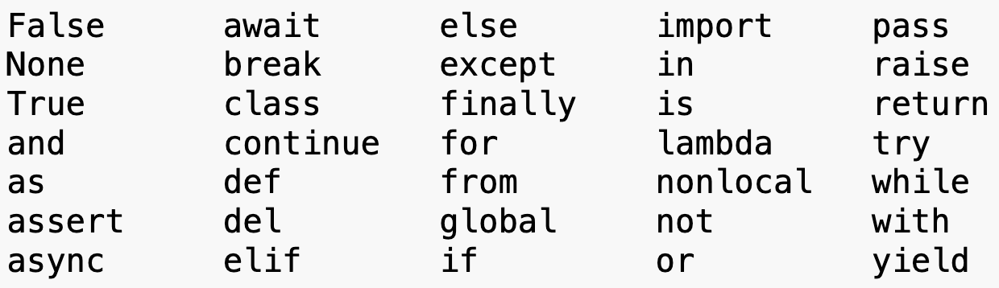
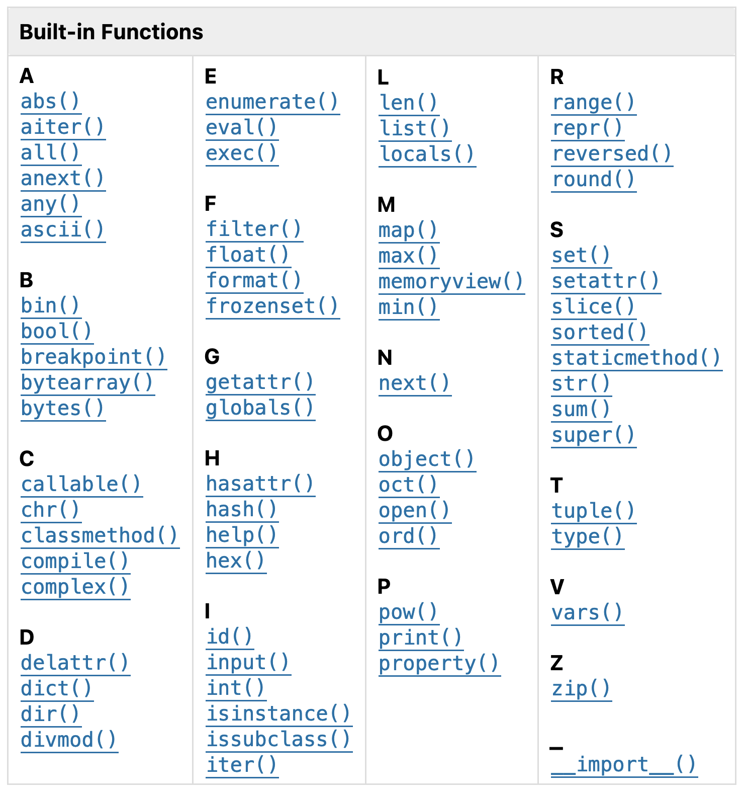

# Day 1 (2025-08-25)

## Flow of control you encountered

* if / elif / else
* for loops
* while loops
* breaking out of a loop

## Data structures you encountered

* Dictionaries
* Lists
* Sets
* Numbers and strings

## Syntax you encountered

* =
* ==
* ()
* []
* {}
* ,
* .
* "
* '

## Keywords you encountered

* None
* True
* break
* def
* elif
* else
* for
* if
* in
* input
* int
* not
* pass
* while

That's 14 of the
[35 keywords in Python](https://docs.python.org/3.12/reference/lexical_analysis.html#keywords)

## Built-in functions you encountered

* dict
* len
* open
* print
* set

That's 5 of the
[71 builtins in Python](https://docs.python.org/3.12/library/functions.html#built-in-funcs)

I only use 22 of those 71 regularly.

## String functions you encountered

* split
* startswith
* strip

Also:

* f-strings
* Single- versus double-quoted strings (and using backslash escapes)
